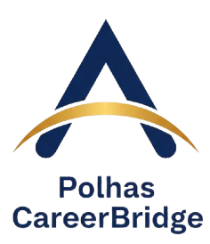

# 🎓 Polhas CareerBridge

Platform resmi Politeknik Hasnur untuk menghubungkan mahasiswa dengan peluang magang dan karir di Hasnur Group dan perusahaan mitra.



## ✨ Tentang Project

**Polhas CareerBridge** adalah platform web modern yang dirancang khusus untuk mahasiswa Politeknik Hasnur dalam mencari lowongan PKL (Praktik Kerja Lapangan) dan pekerjaan di berbagai perusahaan Hasnur Group serta mitra strategis.

### 🎯 Tujuan
- Memudahkan mahasiswa mencari lowongan magang dan kerja
- Menghubungkan mahasiswa dengan perusahaan Hasnur Group
- Menyediakan informasi lowongan yang relevan dengan program studi
- Meningkatkan kualitas penempatan magang mahasiswa

## 🚀 Fitur Utama

### 📋 Lowongan
- **30 Lowongan Aktif** - PKL dan Kerja dari berbagai perusahaan
- **7 Program Studi** - Semua prodi Polhas terintegrasi
- **15+ Perusahaan** - Hasnur Group dan mitra strategis
- **Filter Lengkap** - Cari berdasarkan posisi, tipe (PKL/Kerja), dan prodi

### � Pencarian & Filter
- Real-time search untuk posisi dan perusahaan
- Filter berdasarkan tipe lowongan (PKL/Kerja)
- Filter berdasarkan program studi
- Hasil pencarian yang cepat dan akurat

### 💾 Fitur Interaktif
- **Save Jobs** - Simpan lowongan favorit (localStorage)
- **Detail Modal** - Informasi lengkap lowongan dengan requirements
- **Apply System** - Sistem lamaran dengan konfirmasi
- **Toast Notifications** - Feedback real-time untuk setiap aksi

### 🏢 Mitra & Partner
- **Mitra Hasnur Group** - 3 anak perusahaan dengan logo
- **Mitra Polhas** - 6 perusahaan mitra (BSI, Blibli, GoTo, Komdigi, Pertamina, Spinotek)
- **Supported By** - 4 pendukung pembuatan platform

### 🎨 Design
- **BWA Clean White Style** - Design modern dan professional
- **Responsive** - Mobile-first approach
- **Smooth Animations** - Micro-interactions yang menarik
- **Accessible** - Keyboard navigation support

## 📁 Struktur Project

```
polhas-careerbridge/
├── index.html              # Main application
├── css/
│   └── style.css           # Custom styles & animations
├── js/
│   ├── data.js             # Data (30 jobs, 7 prodi, 25 companies)
│   └── main.js             # Application logic
├── assets/
│   └── img/
│       ├── logo-website/   # Logo utama website
│       ├── mitra-hasnur/   # Logo anak perusahaan Hasnur
│       ├── mitra-polhas/   # Logo perusahaan mitra Polhas
│       └── supported/      # Logo pendukung platform
├── README.md               # Dokumentasi
└── .gitignore              # Git ignore rules
```

## 🎓 Program Studi Polhas

1. **D3 Teknik Otomotif** - 4 lowongan
2. **D3 Teknik Informatika** - 4 lowongan
3. **D3 Budidaya Tanaman Perkebunan** - 3 lowongan
4. **D4 Teknologi Rekayasa Multimedia** - 5 lowongan
5. **D4 Akuntansi Bisnis Digital** - 4 lowongan
6. **D4 Bisnis Digital** - 5 lowongan
7. **D4 Manajemen Pemasaran Internasional** - 5 lowongan

## 🏢 Perusahaan Hasnur Group

### Mining & Energy (9 perusahaan)
- PT Energi Batubara Lestari (EBL)
- PT Bhumi Rantau Energi (BRE)
- PT Mantimin Coal Mining (MCM)
- PT Hasnur Jaya Energi (HJE)
- PT Hasnur Jaya International (HJI)
- PT Hasnur Jaya Tambang (HJT)
- PT Hasnur Jaya Utama (HJU)
- PT Antang Surya Persada (ASP)
- PT Trikarsa Manunggal Jaya (TMJ)

### Logistics & Shipping (3 perusahaan)
- PT Hasnur Internasional Shipping Tbk (HAIS)
- PT Hasnur Resources Terminal (HRT)
- PT Hasnur Mitra Sarana (HMS)

### Services & Technology (5 perusahaan)
- PT Magma Sigma Utama (MSU)
- PT Hasnur Cipta Karya
- PT Hasnur Graha Jaya (HGJ)
- PT Hasnur Informasi Teknologi (HIT)
- PT Hasnur Riung Sinergi (HRS)

### Media & Entertainment (6 perusahaan)
- PT Hasnur Media Citra (HMC)
- PT Radio Gema Oskar Lestari
- PT Citra Kalimantan Mediatama (CKM)
- PT Duta Televisi Indonesia (Duta TV)
- PT Putera Banjar Grafika (PBG)
- PS Barito Putera

### Education & CSR (2 lembaga)
- Yayasan Hasnur Centre (YHC)
- Politeknik Hasnur

## 🤝 Mitra Polhas

1. **Bank Syariah Indonesia** - Perbankan Syariah
2. **Blibli** - E-commerce
3. **GoTo** - Technology & Logistics
4. **Kementerian Komunikasi dan Digital** - Pemerintah
5. **Pertamina** - Energi & Migas
6. **Spinotek** - Technology

## 🛠️ Tech Stack

- **HTML5** - Semantic markup
- **Tailwind CSS** - Utility-first CSS framework (via CDN)
- **Vanilla JavaScript** - ES6 Modules
- **SweetAlert2** - Beautiful alert dialogs
- **Toastify JS** - Toast notifications
- **Plus Jakarta Sans** - Google Fonts (BWA style)

**No build process required!** ✅

## 🚀 Cara Menggunakan

### Quick Start
1. Clone atau download repository
2. Buka `index.html` di browser modern
3. Explore lowongan yang tersedia
4. Filter berdasarkan prodi atau tipe
5. Klik "Lihat Detail" untuk info lengkap
6. Klik "Lamar Sekarang" untuk apply

### Tidak Perlu Instalasi
- ❌ Tidak perlu Node.js
- ❌ Tidak perlu npm/yarn
- ❌ Tidak perlu build tools
- ✅ Langsung buka di browser!

## 📝 Cara Menambah Lowongan

Edit file `js/data.js` dan tambahkan object baru ke array `jobs`:

```javascript
{
    id: 31,
    company: "Nama Perusahaan",
    companyId: 1,
    logo: "assets/img/mitra-hasnur/logo.png",
    role: "Posisi",
    type: "PKL", // atau "Kerja"
    prodi: ["D3 Teknik Informatika"],
    description: "Deskripsi lengkap...",
    requirements: [
        "Syarat 1",
        "Syarat 2",
        "Syarat 3"
    ],
    location: "Lokasi",
    posted: "2026-02-11"
}
```

## 🎨 Cara Menambah Logo

### Logo Mitra Hasnur
1. Tambahkan file logo ke `assets/img/mitra-hasnur/`
2. Update array `companies` di `js/data.js`
3. Logo otomatis muncul di section "Mitra Hasnur Group"

### Logo Mitra Polhas
1. Tambahkan file logo ke `assets/img/mitra-polhas/`
2. Tambahkan data ke array `mitraPolhas` di `js/data.js`:
```javascript
{ id: 7, name: "Nama Perusahaan", logo: "assets/img/mitra-polhas/logo.png" }
```

### Logo Supported
1. Tambahkan file logo ke `assets/img/supported/`
2. Tambahkan data ke array `supported` di `js/data.js`

## 📊 Statistik Project

- **Total Lowongan**: 30 posisi
- **PKL/Magang**: 19 posisi (63%)
- **Kerja**: 11 posisi (37%)
- **Program Studi**: 7 prodi
- **Perusahaan**: 25 perusahaan Hasnur Group
- **Mitra**: 6 perusahaan mitra
- **Total Logo**: 13 logo ditampilkan

## 🌐 Browser Support

- ✅ Chrome 90+ (Recommended)
- ✅ Firefox 88+
- ✅ Safari 14+
- ✅ Edge 90+

## 📱 Responsive Design

- ✅ Mobile (< 768px)
- ✅ Tablet (768px - 1024px)
- ✅ Desktop (> 1024px)

## 📞 Kontak

**Politeknik Hasnur**  
Banjarmasin, Kalimantan Selatan  
Email: info@polhas.ac.id  
Website: [polhas.ac.id](https://polhas.ac.id)

## 🙏 Credits

**Built For**: Politeknik Hasnur  
**Design Inspiration**: BuildWith Angga (BWA) - Clean White Style  
**Supported By**:
- Politeknik Hasnur
- PT Hasnur Informasi Teknologi
- HIMA Teknik Informatika
- Shift Community

---

**Version**: 2.0  
**Last Updated**: February 2026  
**Status**: ✅ Production Ready

**Built with 💙 for Politeknik Hasnur**
